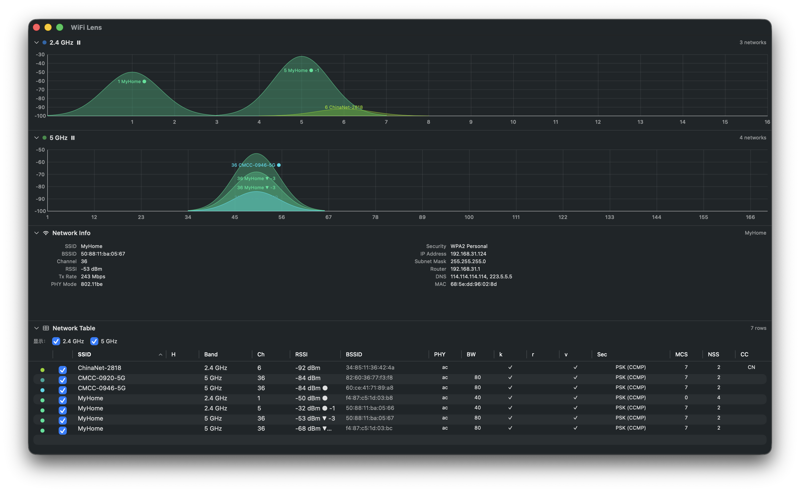

# WiFi Lens

[](https://github.com/SHIINASAMA/wifi-lens/actions?query=workflow%3A%22Build+%26+Release%22)

Simple, open-source Wi-Fi channel and signal strength analyzer for macOS.
Built with SwiftUI, CoreWLAN, and Sparkle.



## Features

- Real-time Wi-Fi scanning across 2.4 GHz, 5 GHz, and 6 GHz bands
- Gaussian bell-curve charts per band with dynamic y-axis scaling
- Per-band freeze, drag-to-zoom, and full-window expand
- Deterministic SSID-based color assignment
- Combined network table with native column sort, row selection, and chart highlighting
- Filter networks by SSID or BSSID across all bands
- 802.11 capability details: PHY generation, channel width, 802.11k/r/v roaming, WPA3, hidden SSID
- Connected network status: IP, gateway, DNS, MAC, channel, Tx rate, security
- Configurable scan interval (1–10 seconds)
- Export per-band charts as PNG or CSV
- Built-in Sparkle auto-update support
- English and Simplified Chinese localization

## Requirements

- macOS 14.0 (Sonoma) or later

> [!IMPORTANT]
> On macOS 14+, Location Services permission is required to read Wi-Fi SSIDs.
> Open **System Settings → Privacy & Security → Location Services** and enable
> the app when prompted.

## Download

[Visit the latest release](https://github.com/SHIINASAMA/wifi-lens/releases/latest/)

### Gatekeeper workaround

Because the application is not signed, macOS Gatekeeper may block it.

- **Right-click** the app icon → **Open** → confirm in the dialog; or
- Run in Terminal:
  ```sh
  xattr -d com.apple.quarantine /Applications/WiFi\ Lens.app
  ```

## Develop

```sh
git clone https://github.com/SHIINASAMA/wifi-lens
cd wifi-lens/WiFiLens

# Build & test via SPM
swift build
swift test

# Open in Xcode for GUI development (required for app bundle with Location Services)
xed WiFiLens.xcodeproj
```

## License

```
Copyright 2020 nolze
Copyright 2026 SHIINASAMA

Licensed under the Apache License, Version 2.0 (the "License");
you may not use this file except in compliance with the License.
You may obtain a copy of the License at

   http://www.apache.org/licenses/LICENSE-2.0

Unless required by applicable law or agreed to in writing, software
distributed under the License is distributed on an "AS IS" BASIS,
WITHOUT WARRANTIES OR CONDITIONS OF ANY KIND, either express or implied.
See the License for the specific language governing permissions and
limitations under the License.
```
